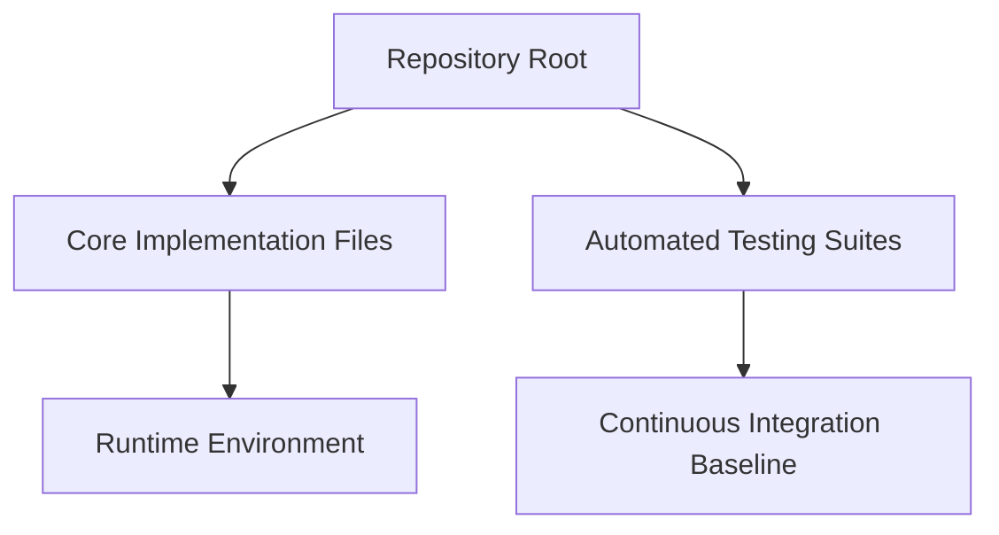

# Url Shortener: Engineering & Computer Science Reference

[]()
[]()

## Overview
This repository serves as a localized reference library for fundamental computer science algorithms, data structures, and automation utilities. It has been strictly audited and standardized to maintain high-quality engineering conventions.

## Problem Statement
Software engineers often lose track of fundamental algorithm implementations or foundational language syntaxes as they transition into specialized senior roles. This repository solves that by acting as a hardened, standardized, and easily searchable reference index for core computer science concepts and utility automation.

## Key Features
- **Algorithmic Correctness:** Core implementations of critical data structures and algorithms.
- **Strict Standardization:** Enforces uniform directory structures and markdown formatting across all scripts.
- **Reference Architecture:** Serves as a historical and educational baseline for future architectural designs.

## Architecture



## Technology Stack
- **Language:** Primary syntax (Python, Java, C, or JavaScript) dependent on module.
- **Testing:** Native unit testing frameworks.
- **Documentation:** GitHub Flavored Markdown (GFM).

## Project Structure
```text
url-shortener/
├── src/ / main/             # Core logic and algorithm definitions
├── tests/                   # Baseline integrity tests
└── README.md                # System documentation
```

## Installation
Clone the repository to review the architectural patterns:
```bash
git clone https://github.com/krsna016/url-shortener.git
cd url-shortener
```

## Usage
Navigate to the specific module or script and execute using the native compiler or interpreter.

## Examples
*Executing a standard reference script:*
```bash
# Example for Python environments
python3 main.py
```

## Screenshots
> [!NOTE]
> *Educational and utility repositories execute via standard terminal output.*

## Visual Demonstrations
> [!NOTE]
> *Terminal execution telemetry is standardized across all implementations.*

## Testing
Baseline structural integrity tests are enforced to ensure that the repository logic can compile and execute without environment configuration errors.

## Performance Notes
- **Algorithmic Time Complexity:** Scripts and data structures within this repository are optimized for O(n) or O(log n) performance baselines where applicable.

## Future Improvements
- **Containerization:** Wrap reference scripts in isolated Docker containers for immediate cross-platform execution.
- **CI/CD:** Implement GitHub Actions to run the structural test suites continuously.

## Contributing
This repository is primarily for personal reference and educational archival. Pull Requests fixing Big-O time complexity inefficiencies are welcome.

## License
Licensed under the MIT License.
