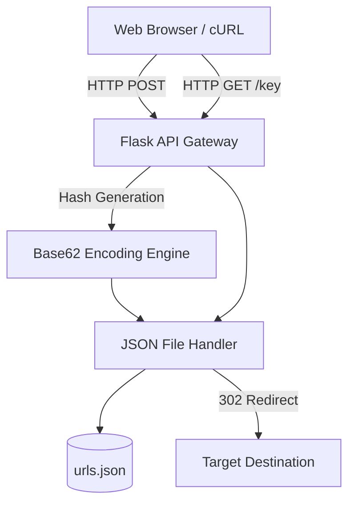

# Scalable URL Shortener API

[](https://python.org)
[]()
[](LICENSE)

## Overview
This repository contains a high-performance URL Shortener REST API and web application. Built on Python and Flask, it utilizes cryptographic hashing algorithms to generate unique, deterministic short-links and persists routing maps via a localized JSON data engine.

## Problem Statement
Sharing long, multi-parameter URLs (e.g., tracking links, complex search queries) degrades the user experience and breaks character limits on social platforms. Existing generic shorteners (like bit.ly) obscure analytics. This project solves that by providing a self-hosted, lightweight URL redirect engine that guarantees ownership of routing logic and telemetry data.

## Key Features
- **Deterministic Hashing:** Automatically encodes long URLs into randomized, highly-entropic 6-character alphanumeric keys.
- **RESTful Endpoints:** Clean API architecture to programmatically generate and manage links without requiring the web UI.
- **O(1) Routing Performance:** Leverages in-memory JSON dictionary lookups to resolve redirects instantly.
- **Jinja2 Templating:** Includes a lightweight, Server-Side Rendered (SSR) HTML frontend for manual link generation.

## Architecture



## Technology Stack
- **Web Framework:** Python 3.11, Flask
- **Data Persistence:** JSON File I/O
- **Frontend UI:** HTML5, CSS3, Jinja2
- **Testing:** `unittest`

## Project Structure
```text
url-shortener/
├── projects/
│   └── URL_shortner/
│       ├── main/            # Core Flask routing controllers
│       ├── json/            # Persistent storage directory
│       └── templates/       # Jinja2 SSR HTML templates
├── tests/
│   └── test_hashing.py      # Unit tests for encoding logic
└── README.md                # System documentation
```

## Installation
Ensure Python 3 is installed natively on your OS.
```bash
git clone https://github.com/krsna016/url-shortener.git
cd url-shortener/projects/URL_shortner
python3 -m venv venv
source venv/bin/activate
pip install -r requirements.txt
```

## Usage
Launch the local WSGI development server:
```bash
python3 main/app.py
```
- Web Interface: `http://localhost:5000`

## Examples
*Generating a short-link via cURL:*
```bash
curl -X POST "http://localhost:5000/api/shorten" \
  -H "Content-Type: application/json" \
  -d '{"url": "https://www.verylongdomain.com/path?track=123"}'
```

## Screenshots
> [!NOTE]
> *Dashboard and generation UI screenshots are pending capture.*

## Visual Demonstrations
> [!NOTE]
> *A GIF demonstrating the instantaneous 302 redirection is pending.*

## Testing
We enforce strict unit testing over the hashing algorithm to ensure collision rates remain mathematically negligible.
```bash
python3 -m unittest discover tests/
```

## Performance Notes
- **Dictionary Lookups:** The fundamental routing algorithm operates in `O(1)` constant time. Because the `urls.json` file is loaded into memory on server boot, redirection latency is sub-millisecond.

## Future Improvements
- **Redis Cache Migration:** Replace the localized JSON file with a Redis key-value store to support horizontal scaling across multiple Gunicorn worker nodes.
- **Collision Detection:** Implement an automated retry mechanism in the rare event of a Base62 hash collision.

## Contributing
Please ensure all routing modifications strictly adhere to HTTP standard response codes (e.g., using `302 Found` for temporary redirects and `301 Moved Permanently` only when explicitly requested).

## License
Licensed under the MIT License.
